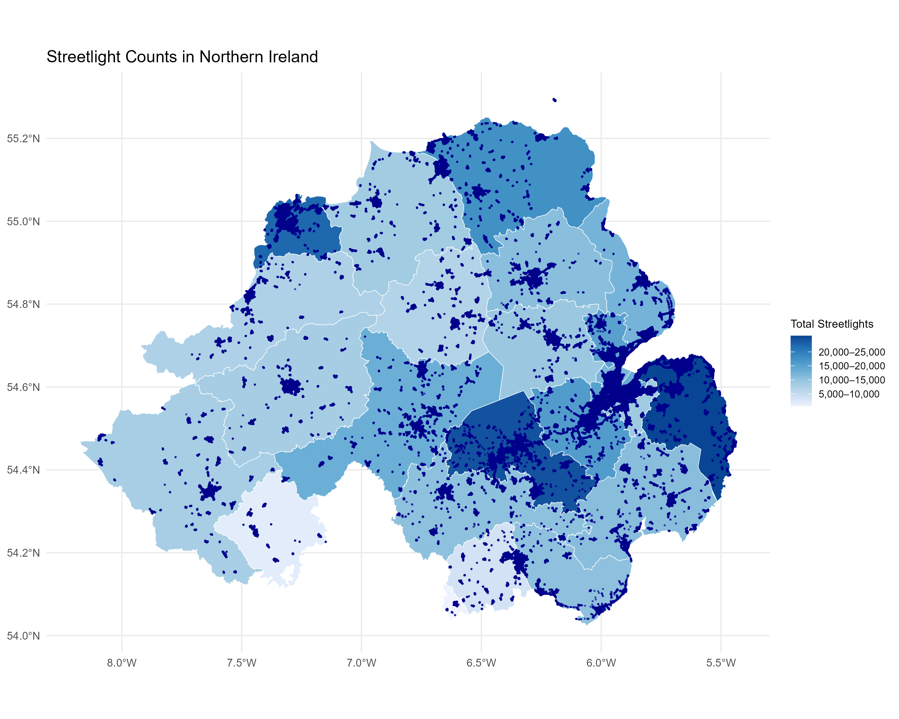
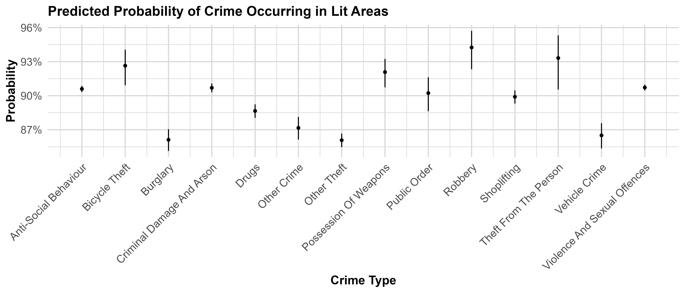
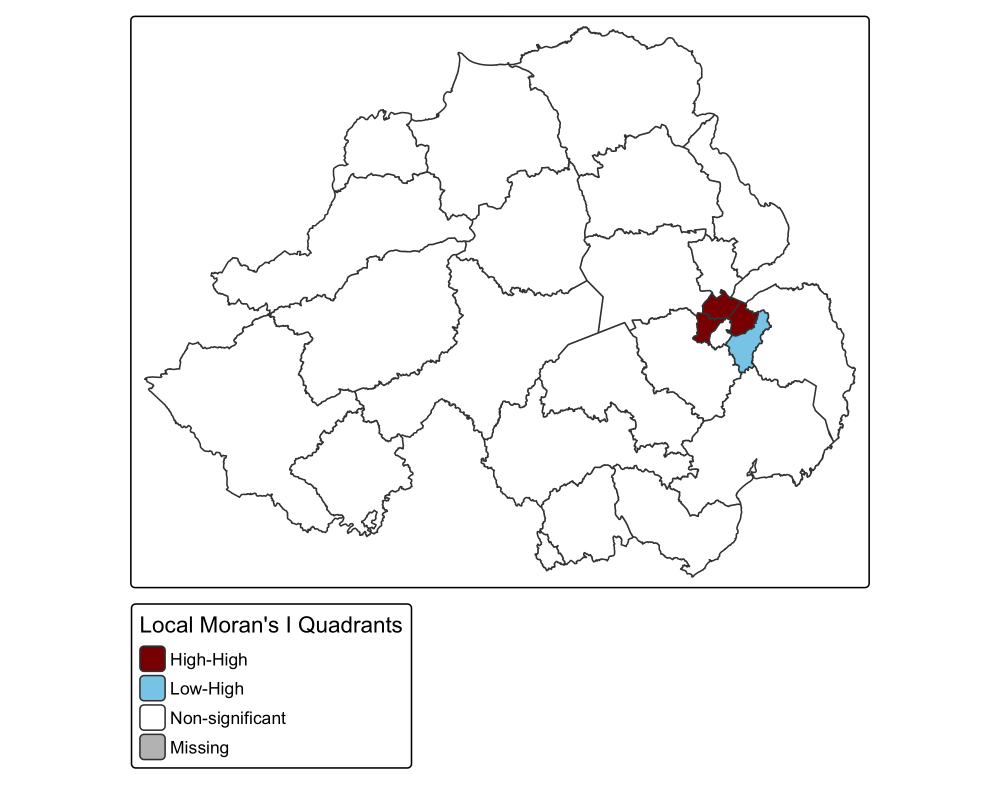

# Crime and Streetlights in the UK: A Case Study of Northern Ireland
The final data analysis project for the Geospatial Analysis class with Alexandra Kapp at the Hertie School (Spring 2025 semester).
 
**Contributors:** *Gayatri Shejwal, Manjiri Satam, Varvara Ilyina*

## Introduction

Public street lighting is one of the most basic safety infrastructures. This project explores whether streetlight density relates meaningfully to the crimes reported in the UK, specifically in Northern Ireland. Using openly available data, we aim to understand whether certain less-lit areas are more vulnerable to crime. While there are several factors contributing to incidence of crime, identifying consistent spatial patterns could provide valuable insights for safer urban planning, including how such infrastructure must be distributed across different neighbourhoods.

This study attempts to answer the following question:
***How does street lighting relate to where and what types of crime occur in Northern Ireland?***

## Methodology

We use publicly available crime and streetlight data, comprising 150,000+ geocoded crime incidents reported and 300,000+ streetlight locations across Northern Ireland between April 2022 and March 2023, along with shapefiles of police force boundaries. Our goal is to assess whether crimes are more likely to occur in under-lit areas or at greater distances from public lighting infrastructure, for a given police constabulary in Northern Ireland.

To analyze spatial proximity, we calculate the distance from each crime location to the nearest streetlight using a nearest-neighbour approach. Due to computational limits, we use a random sample of 10,000 crime points and 10,000 spatially distributed random control points for comparison. We then apply the Kolmogorov–Smirnov and Mann–Whitney U tests to compare their distance distributions.

In a complementary analysis, we evaluate lighting coverage using 30-meter buffer zones around all streetlights. Each crime is flagged as occurring inside or outside a lit zone. Using the full dataset, we conduct a chi-squared test to examine variation in lighting exposure across crime types and season, and fit a logistic regression model to predict the likelihood of a crime falling within a lit area based on crime type and season.

## Results & Discussion

-   **Crime vs. Random Point Distance:** Kolmogorov–Smirnov test (D = 0.8882, p < 2.2e-16) and Mann–Whitney U test (p < 2.2e-16) show that crime locations are significantly different to streetlights than expected by chance.
-   **Lighting Exposure by Crime Type:** A chi-squared test (χ² = 581.4, p < 0.001) reveals that lighting coverage varies significantly across crime categories. The baseline crime type occurs in well-lit areas, and relative to it, drug-related crimes, burglary, etc. are likely to occur in unlit areas, while crimes like robbery and bicycle theft are more likely to occur in well-lit areas.
-   **Overall Coverage and Seasonality:** 91% of all crimes occurred within a 30-meter buffer of a streetlight. Seasonality also plays a role - winter crimes are more likely to occur in the dark, due to longer dark hours.

- Further, **local Moran’s I** identifies spatial crime clusters.
	- A prominent High-High cluster (dark red) appears around Belfast, confirming it as a key crime hotspot.
	- The adjacent Low-High area (light blue) may represent a lower-crime suburb bordering higher-risk zones

## Limitations

-   **Lighting assumption:** We assume that all streetlights are functioning and only relevant during nighttime hours. However, not all crime occurs at night and average daylight hours in Northern Ireland ranges from 7 hours in winter and 17 hours in summer.
-  **Temporal limitation:** The crime data lacks exact timestamps for the incidents, so we cannot definitely match incidents to lighting conditions at the time they occurred.
-   **Spatial approximation:** A 30-meter buffer zone around streetlights may not accurately show how far each light reaches.
-   **Incomplete national data:** While our dataset includes detailed information for Northern Ireland, similar streetlight data is not available for England or Wales, thus limiting the national generalizability of our findings.

## Conclusion

Our analysis reveals that crimes in Northern Ireland tend to occur closer to streetlights than randomly sampled locations. While this challenges the common assumption that crime thrives in darkness, it highlights that lighting is not a universal deterrent.

Some crimes, such as robbery and bicycle theft, are more common in well-lit areas, likely due to higher human activity and opportunity, whereas others, like burglary and drug offences, are more prevalent in under-lit zones. These findings suggest that the relationship between lighting and crime is complex and varies by crime type. Rather than assuming more lighting uniformly reduces crime, policymakers should adopt a context-sensitive approach to public lighting that accounts for both spatial patterns and the nature of criminal activity.
